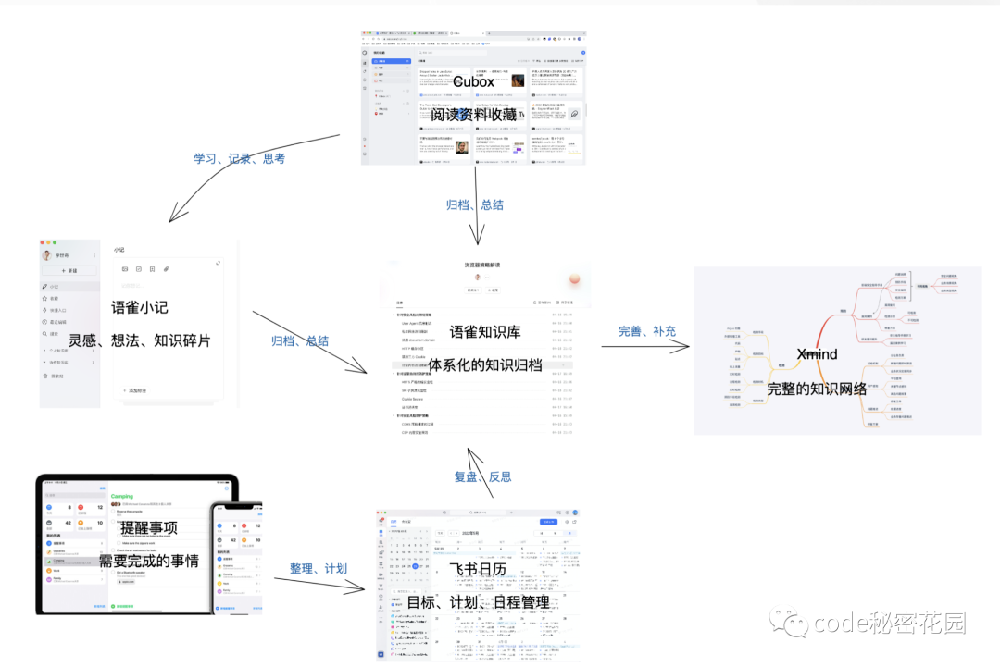

# 如何在繁重的工作中持续成长？

原文链接：[如何在繁重的工作中持续成长？](https://cloud.tencent.com/developer/article/2207594?areaId=106001)【[存档](https://web.archive.org/web/20240212082737/https://cloud.tencent.com/developer/article/2207594?areaId=106001)】

## 主要内容

### 如何在繁重的工作中持续成长

1. [打破成长的误区](#1-认知打破成长误区)
2. [如何高效地利用时间](#2-实施如何高效地利用时间)
3. [坚持沉淀和写作](#3-秘诀坚持沉淀和写作)

## 1. 认知：打破成长误区

### 迷茫期、持续成长、舒适区

* 迷茫期——不知道该做点什么
* 持续成长——持续提升自己
* 舒适区——做什么都没动力

### 主要误区

1. ❌ **个人成长和工作相冲突**
    * ✅ **其实恰恰相反，工作和成长本身就是密不可分的**，比如：业务能力、编码能力、编码技巧、影响力……
    * ✅ **从工作中谋求成长才是最佳选择**
2. ❌ **做自己没了解过的事情才是成长**
    * ❗ 被动做一件事情，和自己把一件事情做到极致，是完全不同的
3. ❌ **学的东西越多，成长越快**
    * ❗ 一个人脑容量是有限的，拓宽自己的眼界和知识广度是完全没问题的，但是拓宽知识广度的前提一定是你已经有了一项非常擅长的方向
    * ✅ 选择合适的方向是最重要的——一定要选择你工作中可能会用到的方向，或者说可以落地到工作中的方向
    * ❗ **将个人成长更好地融入工作中，才可以让自己受益最大化**，否则可能再多的努力都是徒劳的

## 2. 实施：如何高效地利用时间

### 时间管理的重要性

* 常见问题：
    * 混乱型，缺乏对时间和精力最基本的安排
    * 缺乏对事情优先级的判断和复盘，会让我们丧失对工作的成就感
    * 拖延症——知道我要干什么，就是提不起动力
* 熵增定律：**在一个「孤立」系统里，如果没有「外力」做功，其总混乱度（即熵）会不断增大。**
    * 人活着就是在对抗熵增定律
    * 想要避免熵增，光靠自然的变化是很难的，我们必须引入一些外力

### 常见的时间管理方法

* GTD（Getting Things Done）
    1. **收集**信息
    2. **清理**无关信息
    3. **组织**待办事项
    4. **执行**组织好的事项
    5. **复盘**已经完成的事项
* 三只青蛙时间管理法
    * 本质是：优先级管理
    * 面临三个重要任务的时候，先做更艰巨、更重要的那一个
* 番茄时间管理法
    * 把时间分为多个番茄时间，每一段为不可再分割的一块时间

### 记录：提醒事项

* 按标签归类
* 挂上 deadline 时间提醒
* 使用合适的工具进行记录（app / PC 端同步）

### 整理：优先级 & 制定计划

* ❗ **更大的效率来自于重要事情上做得好，而不是在处处做得好**
* 四象限法则：**重要且紧急、重要不紧急、紧急不重要、不紧急不重要**
    * 不重要不紧急：敢于说不
    * 重要不紧急：对对方说不，但是记录下来

### 执行：张弛有度的专注

* 番茄钟的重要原则：**执行时一定要保持专注，如果不是什么特别重要、紧急的事情一定不能打断这个钟**
* 注意休息——短时间休息和长时间休息
* **技巧：找出事情的交集**
    * **我们只要在整理阶段更好的找到这些事情的交集，就可以更高效的利用有限的时间**
* **技巧：高效沟通**
    * 面对面沟通的效率要大于语音沟通，而语音沟通的效率要大于打字。
* **技巧：碎片时间**
    * 在碎片时间中做一些简单的事情，比如整理计划、阅读文章等等
    * **怎么去安排好这些碎片时间，可能会成为你能脱颖而出的一个制胜法宝**

## 3. 秘诀：坚持沉淀和写作

### 写作可分为两类

* **个人的沉淀**：可以是平时的工作记录、一些知识碎片、你的个人知识体系等等；
* **对外的分享**：包括工作中的技术方案、对外发表的技术文章等等。

### 个人沉淀

* 好处：**巩固记忆、建立个人知识体系**
* **构建个人知识系统的要点**
    * 方便管理
    * 体系化
    * 方便提取
* **如何做好知识管理**
    * 对外部输入做记录
    * 对知识库内容分类和系统化总结
    * 随时随地把知识库里的知识提取出来
    * 针对性学习自己比较薄弱、感兴趣或者未来工作中会用到的知识分支

    

### 对外分享

* 好处：**更好地理解知识、提升个人 / 团队影响力、提升团队技术氛围**
* **写作技巧：先枝后叶**
    * 一定有拥有清晰的条理和结构，最好是先枝后叶，先把文章整体的结构和大纲列好，再往里填充完善
    * 2W1H 原则：**是什么、为什么、怎么做**
* **写作技巧：善用图片**
    * 有时候可能需要一大堆文字描述才能说明白的内容，一张图片就能搞定
* **写作技巧：从读者角度思考**
    * 我们对外的文章第一目的还是要给读者去看的，读者不一定有和我们一样的知识背景