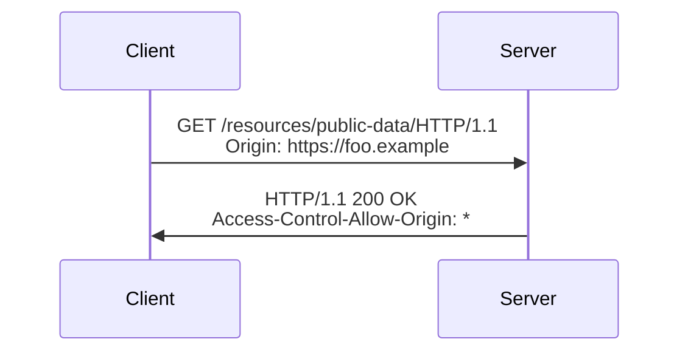

# Simple Request

A request is called a **simple request** if it does not trigger a [CORS](./CORS.md) [preflight](./Preflight%20Request.md).

A request is simple if it meets the following requirements:

* The request method is one of these allowed methods:
    * [`GET`](../http/methods/GET.md)
    * [`HEAD`](../http/methods/HEAD.md)
    * [`POST`](../http/methods/POST.md)
* Apart from headers set by the user agent, the only headers that allowed to be set are the headers defined in the [Fetch spec](https://fetch.spec.whatwg.org/) as **CORS-safelisted request headers**, which are:
    * `Accept`
    * `Accept-Language`
    * `Content-Language`
    * `Content-Type` (but only with a value of `application/x-www-form-urlencoded`, `multipart/form-data`, or `text/plain`)
    * `Range` (only with a [simple range header value](https://fetch.spec.whatwg.org/#simple-range-header-value), e.g. `bytes=256`, or `bytes=127-255`)
* If the request is made using an `XMLHttpRequest` object, no event listeners are registered on the object returned by the `XMLHttpRequest.upload` property used in the request; that is, given an `XMLHttpRequest` object `xhr`, no code has called `xhr.upload.addEventListener()` to add an event listener to monitor the upload.
* No `ReadableStream` object is used in the request.

## Example

Consider the following scenario: the web content at `https://foo.example` wishes to fetch content from `https://bar.other`. This is some sample code that may be deployed on `https://foo.example`:

```js
const fetchPromise = fetch("https://bar.other");

fetchPromise
  .then((response) => response.json())
  .then((data) => {
    console.log(data);
  });
```

This operation performs a simple exchange between the client and server, using CORS headers to handle the privileges:



The request sent from the browser to the server is as follows:

```http
GET /resources/public-data/ HTTP/1.1
Host: bar.other
User-Agent: Mozilla/5.0 (Macintosh; Intel Mac OS X 10.14; rv:71.0) Gecko/20100101 Firefox/71.0
Accept: text/html,application/xhtml+xml,application/xml;q=0.9,*/*;q=0.8
Accept-Language: en-us,en;q=0.5
Accept-Encoding: gzip,deflate
Connection: keep-alive
Origin: https://foo.example
```

The request header of note is `Origin`, showing that the request comes from `https://foo.example`.

Now the server responds with the following data:

```http
HTTP/1.1 200 OK
Date: Mon, 01 Dec 2008 00:23:53 GMT
Server: Apache/2
Access-Control-Allow-Origin: *
Keep-Alive: timeout=2, max=100
Connection: Keep-Alive
Transfer-Encoding: chunked
Content-Type: application/xml

[…XML Data…]
```

The header

```http
Access-Control-Allow-Origin: *
```

is the simplest use of the access control protocol. If the resource owner would otherwise restrict access to the resource to requests _only_ from `https://foo.example` (i.e. no other domains can do cross-origin requests to get this resource) they would send:

```http
Access-Control-Allow-Origin: https://foo.example
```

> **Note:** When responding to a [credentialed requests](./Request%20with%20Credentials.md) request, the server must specify an origin in the value of the `Access-Control-Allow-Origin` header, instead of specifying the "`*`" wildcard.

## References

* [MDN](https://developer.mozilla.org/)
    * [Reference: HTTP Cross-Origin Resource Sharing (CORS)](https://developer.mozilla.org/en-US/docs/Web/HTTP/CORS#simple_requests)