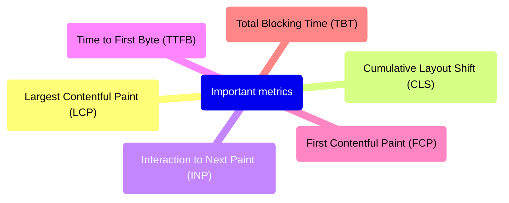

# Web Performance Metrics

## Important metrics to measure

* Largest Contentful Paint (LCP)
* Cumulative Layout Shift (CLS)
* Interaction to Next Paint (INP)
* Time to First Byte (TTFB)
* First Contentful Paint (FCP)
* Total Blocking Time (TBT)

## References

* [**web.dev**](https://web.dev/)
    * [Metrics](https://web.dev/explore/metrics)
    * [User-Centric Performance Metrics](https://web.dev/articles/user-centric-performance-metrics)