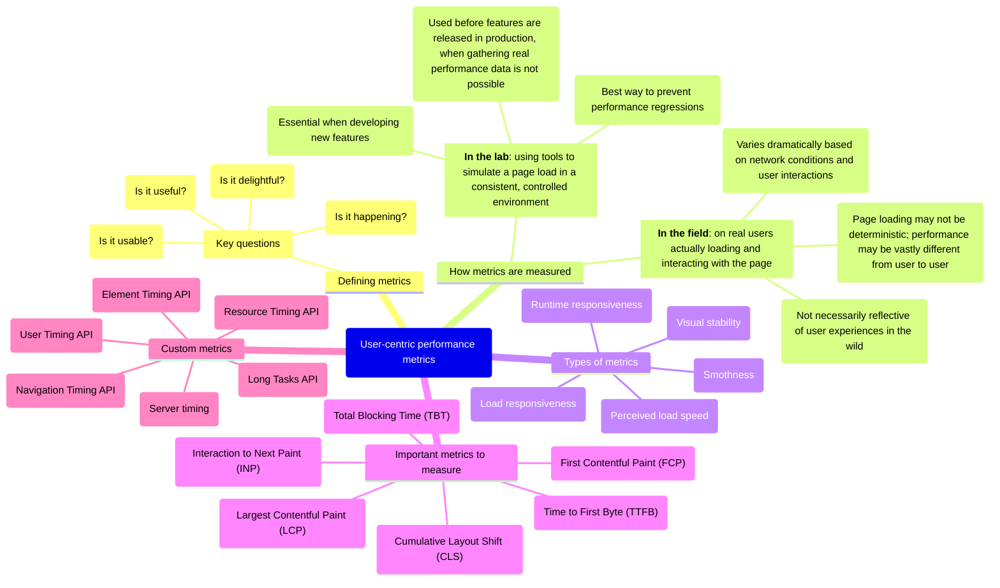

# Web Performance Metrics

## [User-centric performance metrics](https://web.dev/articles/user-centric-performance-metrics)

### [Important metrics to measure](https://web.dev/articles/user-centric-performance-metrics#important_metrics_to_measure)

| Metric | Description |
| --- | --- |
| First Contentful Paint (FCP) | measures the time from when the page starts loading to when any part of the page's content is rendered on the screen. |
| Largest Contentful Paint (LCP) | measures the time from when the page starts loading to when the largest text block or image element is rendered on the screen. |
| Interaction to Next Paint (INP) | measures the latency of every tap, click, or keyboard interaction made with the page, and—based on the number of interactions—selects the worst interaction latency of the page (or close to the highest) as a single, representative value to describe a page's overall responsiveness. |
| Total Blocking Time (TBT) | measures the total amount of time between FCP and TTI where the main thread was blocked for long enough to prevent input responsiveness. |
| Cumulative Layout Shift (CLS) | measures the time from when the page starts loading to when the largest text block or image element is rendered on the screen. |
| Time to First Byte (TTFB) | Measures the time it takes for the network to respond to a user request with the first byte of a resource.

## References

* [**web.dev**](https://web.dev/)
    * [Metrics](https://web.dev/explore/metrics)
    * [User-Centric Performance Metrics](https://web.dev/articles/user-centric-performance-metrics)